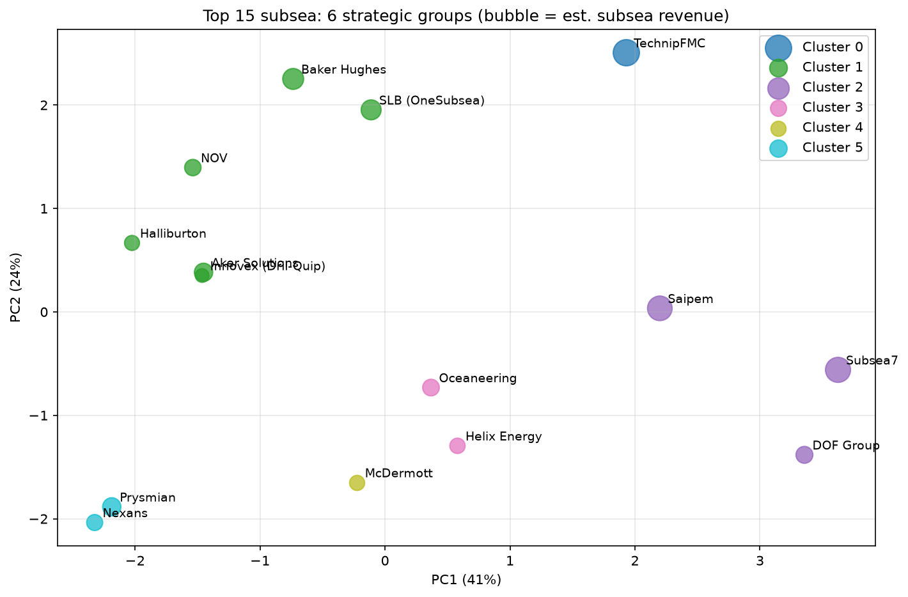
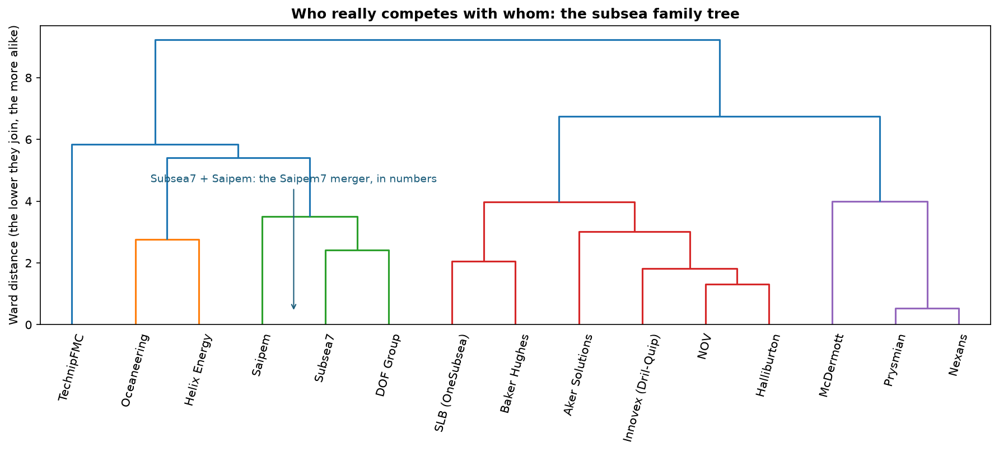
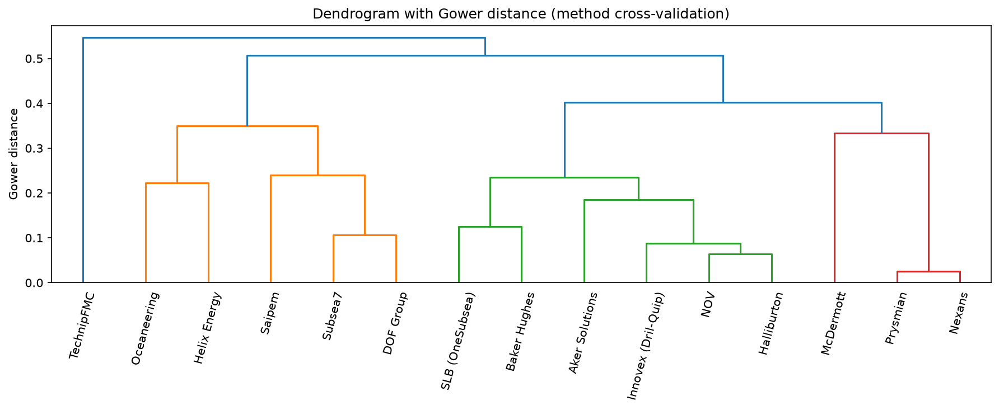

# 🌊 Clustering the Top 15 of the Subsea Market

A data science analysis I built to answer one simple question:
**who actually competes with whom in the subsea market?**

I put together a matrix of features for the 15 largest players and let the
algorithm reveal the strategic groups.



## Results (k=6, chosen by silhouette)

| Cluster | Strategic group | Companies |
|---|---|---|
| 0 | 🏭 Full-scope integrated | TechnipFMC |
| 1 | 🧰 Equipment / diversified | SLB (OneSubsea), Baker Hughes, Aker Solutions, NOV, Halliburton, Innovex |
| 2 | 🚢 Fleet owners (SURF installation) | **Subsea7, Saipem**, DOF Group |
| 3 | 🎯 Services and intervention | Oceaneering, Helix Energy |
| 4 | ⚓ Fleet without subsea scale | McDermott |
| 5 | 🔌 Cable specialists | Prysmian, Nexans |

The analysis quantifies why the **Subsea7 + Saipem (Saipem7, expected to close in the
second half of 2026)** merger makes industrial sense: they are the two closest profiles
in the sector under any metric I use. The dendrogram shows it visually:



## Robustness tests

Before publishing, I attacked the study three ways:

1. **Leave-one-feature-out**: I dropped one variable at a time and compared the groups
   with the Adjusted Rand Index: **mean ARI of 0.73** (minimum 0.44 dropping `sps`).
   The structure does not depend on a single feature.
2. **Monte Carlo on the estimates**: I perturbed my estimates (`pct_subsea`, `fleet`)
   by ±20% over 300 runs: **mean stability of 90.8%**. Every company stays in its group
   in at least 73% of runs (the least stable is McDermott, all above the 70% threshold).
   Most stable: TechnipFMC, Oceaneering, Helix, Subsea7, DOF.
3. **Gower distance**: I re-ran the hierarchical clustering with the correct metric for
   mixed data (continuous + binary), implemented by hand. The main groups hold:



## Repo structure

```
├── analysis.py                     # full pipeline (runs in ~10s)
├── top15_subsea_clusters.ipynb     # notebook version (Colab-ready)
├── index.html                      # study page
├── data/
│   └── top15_subsea_clusters.csv   # matrix + clusters + stability
├── images/                         # charts at 150 dpi (README and page)
├── docs/                           # supporting material (PDF)
└── requirements.txt
```

## How to run

```bash
pip install -r requirements.txt
python analysis.py
```

Everything is seeded, so the numbers above reproduce exactly.

## Sources and caveats

- **Revenue**: 2025 annual reports, rounded. Group revenue, not subsea only.
- **% subsea, fleet, scope flags**: my estimates based on Mordor Intelligence,
  Spherical Insights (Jun-Jul 2026) and the companies' pages. The base is editable, so
  if you have better numbers, open a PR 😉
- Context fact: the top 5 (TechnipFMC, Subsea7, Aker Solutions, Baker Hughes, SLB
  OneSubsea) hold **58% of global EPCI value** (Mordor Intelligence, 2025).
- **Exploratory and descriptive** analysis: clustering is sensitive to the chosen
  features. Changing the `features` list changes the groups; that is expected, not a bug.

## Stack

Python · pandas · scikit-learn (K-Means, PCA, silhouette, ARI) · scipy (Ward, manual Gower) · matplotlib
